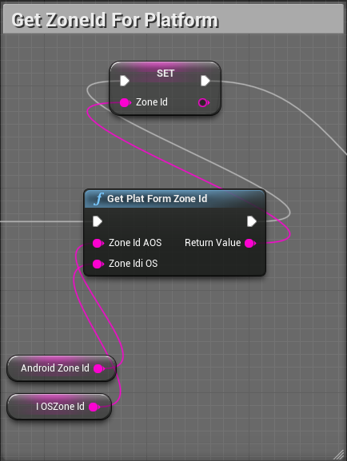
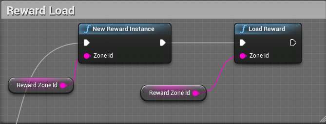
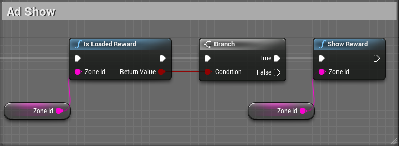

# BidmadPlugin

BidmadPlugin은 모바일 앱 광고 SDK인 Bidmad를 Unreal에서 사용하기 위한 Plugin입니다.<br>
Plugin을 사용하여 Unreal 모바일 앱에서 전면 / 보상형 광고를 게재 할 수 있습니다.<br>

- [최신 버전 및 샘플 프로젝트 다운로드](https://github.com/bidmad/Bidmad-Unreal/archive/master.zip)

## 시작하기
### 1. 요구 사항 

|OS|버전|참고사항|
|---|---|---|
|Android|TargetSDK 29 / MinSDK 19|TargetSDK는 Google 정책에 따라 변경 됩니다.<br>("[Google Play 타겟 API 요구사항](https://developer.android.com/distribute/best-practices/develop/target-sdk?hl=ko)") |
|iOS|Target10.0||

### 2. Plugin 추가 및 설정
샘플 프로젝트에 포함된 **Plugins/BidmadPlugin**의 폴더와 파일을 Plugin을 적용할 프로젝트의 Plugins폴더로 복사합니다.<br>
그리고, 프로젝트 내 **Source/프로젝트.Build.cs**파일에 선언된 PublicDependencyModuleNames.AddRange에 BidmadPlugin을 추가합니다.

```
PublicDependencyModuleNames.AddRange(new string[] { "Core", "CoreUObject", "Engine", "InputCore", "HeadMountedDisplay", "BidmadPlugin" });
```

#### 2.1 iOS 설정

iOS의 경우 아래와 같이 추가 프로젝트 설정이 필요합니다.
​
1. **DefaultEngine.ini** 파일에 다음과 같이 프로젝트 설정을 추가합니다.

```
AdditionalLinkerFlags=-ObjC
AdditionalPlistData=
    <key>GADApplicationIdentifier</key>
    <string>ca-app-pub-XXXX~XXXX</string>
    <key>NSAppTransportSecurity</key>
    <dict>
    <key>NSAllowsArbitraryLoads</key><true/>
    <key>NSAllowsArbitraryLoadsForMedia</key><true/>
    <key>NSAllowsArbitraryLoadsInWebContent</key><true/>
    </dict>
bGenerateXCArchive=True
```

위 설정 값 중 <string>ca-app-pub-XXXX~XXXX</string>을 광고를 집행하는 계정의 GADApplicationIdentifier로 변경합니다.<br>
*GADApplicationIdentifier 값은 Google Admob 계정에 등록한 앱의 ID로 Admob Dashboard에서 확인할 수 있습니다.<br><br>
​
2. xcodeprj파일을 통해 프로젝트 세팅을 진행하는 경우 BuildSetting > Bitcode를 YES로 세팅합니다.<br>
(언리얼엔진의 경우 default bitcode=YES)

### 3. Plugin 사용

Plugin을 통해 광고를 요청(Load)하고 광고를 노출(Show)하는 방법은 다음과 같습니다.<br>
(*Function에 대한 상세 사항은 4번 항목을 참고 바랍니다.)

#### 3.1 Set ZoneId

Plugin에서는 Android / iOS가 서로 다른 ZoneId를 사용하므로 ZoneId 세팅에 있어 분기 처리가 필요합니다.<br>
GetPlatFormZoneId Function을 사용하면 현재 Platform에 따른 ZoneId를 얻을 수 있습니다.



#### 3.2 AD Load

광고를 Load 하는 방법은 간단합니다.<br>
Plugin에서 제공하는 NewInstance와 Load Function을 차례로 호출하세요.<br>

Callback을 통해서 Load 호출 결과를 확인할 수 있습니다.



*Reward / Interstitial 광고 요청 후 광고가 Load 되기까지 일정 시간 딜레이가 발생합니다.<br>
Load 딜레이를 View단에 노출시키지 않기 위해 앱 시작 시 바로 광고를 요청하는 것을 권장 드립니다.

#### 3.3 Ad Show

Plugin에서는 광고 로드 여부를 확인할 수 있는 IsLoaded Function를 제공합니다.<br>
IsLoaded를 호출하여 광고가 로드 되었음을 확인 후 Show를 호출하면 광고가 노출됩니다.



*광고를 Show했다면 Plugin에서 다시 Load를 수행합니다.<br>
이때 호출된 Load의 결과가 Fail인 경우에는 Load를 재호출 하지 않습니다.

#### 3.4 Ad Callback

Plugin에서는 광고 이벤트에 따라 Callback 함수를 제공합니다.<br>
Load / Show / Fail 등 광고에 관련된 이벤트 발생 후 처리가 필요하다면 Callback함수를 등록하여 사용하세요.<br>
(*상세 사항은 5반 항목을 참고 바랍니다.)

```cpp
#include "RewardCallback.h"
....
ABidmadPluginSampleGameMode::ABidmadPluginSampleGameMode(){
    if(FBidmadPluginModule::isBidmadModuleStart){
        FRewardCallback::OnLoadAd.AddUObject(this, &ABidmadPluginSampleGameMode::OnRewardLoadAd);
        FRewardCallback::OnFailedAd.AddUObject(this, &ABidmadPluginSampleGameMode::OnRewardFailedAd);
        ...
    }
}

void ABidmadPluginSampleGameMode::OnRewardLoadAd(const FString& zoneId){
    UE_LOG(LogTemp, Warning, TEXT("[OnRewardLoadAd] #####"));
}
void ABidmadPluginSampleGameMode::OnRewardFailedAd(const FString& zoneId){
    UE_LOG(LogTemp, Warning, TEXT("[OnRewardFailedAd] #####"));
}
...
```

### 4. Plugin Function

BidmadPlugin은 Interstitial / Reward 광고 타입에 대한 BluePrintFunction 제공하고 있습니다.

#### 4.1 NewInstance

NewInstance는 ZoneId를 기준으로 신규 Instance를 생성하며 동일 ZoneId에 대해 1개의 Instance를 가집니다.

```cpp
UFUNCTION(BlueprintCallable,Category="BidmadReward")
static void NewRewardInstance(FString zoneId);

UFUNCTION(BlueprintCallable,Category="BidmadInterstitial")
static void NewInterstitialInstance(FString zoneId);
```

#### 4.2 Load

Load는 NewInstance로 생성된 Instance를 통해 광고를 요청합니다.

```cpp
UFUNCTION(BlueprintCallable,Category="BidmadReward")
static void LoadReward(FString zoneId);

UFUNCTION(BlueprintCallable,Category="BidmadInterstitial")
static void LoadInterstitial(FString zoneId);
```

#### 4.3 IsLoaded

IsLoaded는 Instance가 Load를 수행 후 광고를 정상 수신 했는지 여부를 확인하기 위한 Function으로 Instance가 광고를 수신했다면 true를 반환합니다.

```cpp
UFUNCTION(BlueprintCallable,Category="BidmadReward")
static bool IsLoadedReward(FString zoneId);

UFUNCTION(BlueprintCallable,Category="BidmadInterstitial")
static bool IsLoadedInterstitial(FString zoneId);
```

#### 4.4 Show

Show는 Instance가 Load를 통해 광고를 요청/수신한 상태라면, 수신한 광고를 노출 시킵니다.<br>
Show를 수행 후 Plugin에서 광고를 다시 Load 합니다.

```cpp
UFUNCTION(BlueprintCallable,Category="BidmadReward")
static void ShowReward(FString zoneId);

UFUNCTION(BlueprintCallable,Category="BidmadInterstitial")
static void ShowInterstitial(FString zoneId);
```

#### 4.5 DeleteInstance

DeleteInstance는 NewInstance로 생성된 Instance 할당을 해제해야 할 필요가 있는 경우 사용합니다.<br>
DeleteInstance 호출 후 Load, IsLoaded, Show를 호출하기 위해서는 다시 NewInstance를 호출해야 합니다.

```cpp
UFUNCTION(BlueprintCallable,Category="BidmadReward")
static void DeleteRewardInstance(FString zoneId);

UFUNCTION(BlueprintCallable,Category="BidmadInterstitial")
static void DeleteInstanceInterstitial(FString zoneId);
```

#### 4.5 GetPlatFormZoneId

Plugin은 Android / iOS Platform에 따라 별도로 ZoneId가 발급됩니다.<br>
GetPlatFormZoneId는 발급받은 Android / iOS ZoneId를 전달 시 PlatForm에 맞는 ZoneId를 반환합니다.

```cpp
UFUNCTION(BlueprintCallable,Category="BidmadCommon")
static FString GetPlatFormZoneId(FString zoneIdAOS, FString zoneIdiOS);
```

### 5. Callback Delegate

BidmadPlugin에서 광고 관련 이벤트를 콜백 델리게이트를 통해 콜백 함수로 이벤트 발생을 알립니다.<br>
이벤트 발생에 따른 처리가 필요한 경우 각 이벤트에 따라 처리해야 합니다.

#### 5.1 Reward

```cpp
//FRewardCallback
static FOnLoadAd OnLoadAd; //광고 Load 수행 후 정상적으로 광고를 수신 한 경우 발생.
static FOnShowAd OnShowAd; //광고 Show 수행 시 발생.
static FOnFailedAd OnFailedAd; //광고 Load 수행 후 광고를 수신하지 못한 경우 발생.
static FOnCompleteAd OnCompleteAd; //Reward 광고에서 Reward 지급기준이 충족된 경우 발생.
static FOnCloseAd OnCloseAd; //광고를 Close한 경우 발생.
static FOnClickAd OnClickAd; //광고를 Click한 경우 발생.
static FOnSkippedAd OnSkippedAd; //Reward 광고에서 Reward 지급기준을 충족시지키 못하고 광고가 종료된 경우 발생.
```

#### 5.2 Interstitial

```cpp
//FInterstitialCallback
static FOnLoadAd OnLoadAd; //광고 Load 수행 후 정상적으로 광고를 수신 한 경우 발생.
static FOnShowAd OnShowAd; //광고 Show 수행 시 발생.
static FOnFailedAd OnFailedAd; //광고 Load 수행 후 광고를 수신하지 못한 경우 발생.
static FOnCloseAd OnCloseAd; //광고를 Close한 경우 발생.
```
