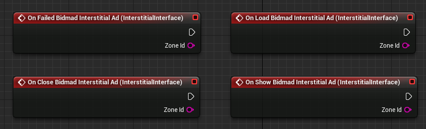
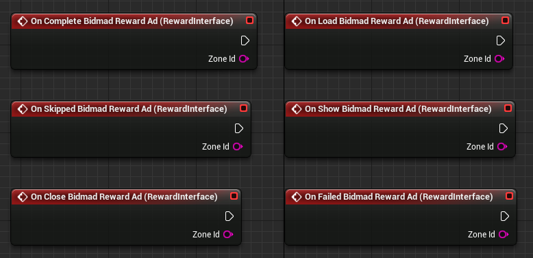

# BidmadPlugin

BidmadPlugin은 모바일 앱 광고 SDK인 Bidmad를 Unreal에서 사용하기 위한 Plugin입니다.<br>
Plugin을 사용하여 Unreal 모바일 앱에서 전면 / 보상형 광고를 게재 할 수 있습니다.<br>

- [최신 버전 및 샘플 프로젝트 다운로드](https://github.com/bidmad/Bidmad-Unreal/archive/master.zip)

## 시작하기
### 1. 요구 사항 

|OS|버전|참고사항|
|---|---|---|
|Android|TargetSDK 29 / MinSDK 19|TargetSDK는 Google 정책에 따라 변경 됩니다.<br>("[Google Play 타겟 API 요구사항](https://developer.android.com/distribute/best-practices/develop/target-sdk?hl=ko)") |
|iOS|Target10.0||

### 2. Plugin 추가 및 설정
샘플 프로젝트에 포함된 **Plugins/BidmadPlugin**의 폴더와 파일을 Plugin을 적용할 프로젝트의 Plugins폴더로 복사합니다.<br>
그리고, 프로젝트 내 **Source/프로젝트.Build.cs**파일에 선언된 PublicDependencyModuleNames.AddRange에 BidmadPlugin을 추가합니다.

```
PublicDependencyModuleNames.AddRange(new string[] { "Core", "CoreUObject", "Engine", "InputCore", "HeadMountedDisplay", "BidmadPlugin" });
```

#### 2.1 iOS 설정

iOS의 경우 아래와 같이 추가 프로젝트 설정이 필요합니다.<br>
​*Apple Store에서 요구하는 개인정보 보호에 관한 가이드가 필요한 경우 [이곳](https://github.com/bidmad/Bidmad-Unreal/wiki/Apple-privacy-survey%5BKOR%5D)을 참고하세요.

1. **DefaultEngine.ini** 파일에 다음과 같이 프로젝트 설정을 추가합니다.

*기본 설정
```
AdditionalLinkerFlags=-ObjC
AdditionalPlistData=
    <key>GADApplicationIdentifier</key>
    <string>ca-app-pub-XXXX~XXXX</string>
    <key>NSAppTransportSecurity</key>
    <dict>
    <key>NSAllowsArbitraryLoads</key><true/>
    <key>NSAllowsArbitraryLoadsForMedia</key><true/>
    <key>NSAllowsArbitraryLoadsInWebContent</key><true/>
    </dict>
bGenerateXCArchive=True
```

위 설정 값 중 <string>ca-app-pub-XXXX~XXXX</string>을 광고를 집행하는 계정의 GADApplicationIdentifier로 변경합니다.<br>
*GADApplicationIdentifier 값은 Google Admob 계정에 등록한 앱의 ID로 Admob Dashboard에서 확인할 수 있습니다.<br><br>
​
*iOS 14 이상에서의 대응을 위해 AdditionalPlistData에 NSUserTrackingUsageDescription 및 SKAdNetworkItems 추가합니다.
```
AdditionalPlistData=
    ...
    <key>NSUserTrackingUsageDescription</key>
    <string>Write your description here</string>
    <key>SKAdNetworkItems</key>
    <array>
      <dict>
       <key>SKAdNetworkIdentifier</key>
       <string>cstr6suwn9.skadnetwork</string>
      </dict>
      <dict>
        <key>SKAdNetworkIdentifier</key>
        <string>v9wttpbfk9.skadnetwork</string>
      </dict>
      <dict>
        <key>SKAdNetworkIdentifier</key>
        <string>n38lu8286q.skadnetwork</string>
      </dict>
      <dict>
        <key>SKAdNetworkIdentifier</key>
        <string>4dzt52r2t5.skadnetwork</string>
      </dict>
      <dict>
        <key>SKAdNetworkIdentifier</key>
        <string>bvpn9ufa9b.skadnetwork</string>
      </dict>
      <dict>
        <key>SKAdNetworkIdentifier</key>
        <string>2u9pt9hc89.skadnetwork</string>
      </dict>
      <dict>
        <key>SKAdNetworkIdentifier</key>
        <string>4468km3ulz.skadnetwork</string>
      </dict>
      <dict>
        <key>SKAdNetworkIdentifier</key>
        <string>4fzdc2evr5.skadnetwork</string>
      </dict>
      <dict>
        <key>SKAdNetworkIdentifier</key>
        <string>7ug5zh24hu.skadnetwork</string>
      </dict>
      <dict>
        <key>SKAdNetworkIdentifier</key>
        <string>8s468mfl3y.skadnetwork</string>
      </dict>
      <dict>
        <key>SKAdNetworkIdentifier</key>
        <string>9rd848q2bz.skadnetwork</string>
      </dict>
      <dict>
        <key>SKAdNetworkIdentifier</key>
        <string>9t245vhmpl.skadnetwork</string>
      </dict>
      <dict>
        <key>SKAdNetworkIdentifier</key>
        <string>av6w8kgt66.skadnetwork</string>
      </dict>
      <dict>
        <key>SKAdNetworkIdentifier</key>
        <string>f38h382jlk.skadnetwork</string>
      </dict>
      <dict>
        <key>SKAdNetworkIdentifier</key>
        <string>hs6bdukanm.skadnetwork</string>
      </dict>
      <dict>
        <key>SKAdNetworkIdentifier</key>
        <string>kbd757ywx3.skadnetwork</string>
      </dict>
      <dict>
        <key>SKAdNetworkIdentifier</key>
        <string>ludvb6z3bs.skadnetwork</string>
      </dict>
      <dict>
        <key>SKAdNetworkIdentifier</key>
        <string>m8dbw4sv7c.skadnetwork</string>
      </dict>
      <dict>
        <key>SKAdNetworkIdentifier</key>
        <string>mlmmfzh3r3.skadnetwork</string>
      </dict>
      <dict>
        <key>SKAdNetworkIdentifier</key>
        <string>prcb7njmu6.skadnetwork</string>
      </dict>
      <dict>
        <key>SKAdNetworkIdentifier</key>
        <string>t38b2kh725.skadnetwork</string>
      </dict>
      <dict>
        <key>SKAdNetworkIdentifier</key>
        <string>tl55sbb4fm.skadnetwork</string>
      </dict>
      <dict>
        <key>SKAdNetworkIdentifier</key>
        <string>wzmmz9fp6w.skadnetwork</string>
      </dict>
      <dict>
        <key>SKAdNetworkIdentifier</key>
        <string>yclnxrl5pm.skadnetwork</string>
      </dict>
      <dict>
        <key>SKAdNetworkIdentifier</key>
        <string>ydx93a7ass.skadnetwork</string>
      </dict>
    </array>
bGenerateXCArchive=True
```

*위 작업을 완료 한 후 **DefaultEngine.ini**에 추가된 내용은 아래와 같습니다.
```
AdditionalLinkerFlags=-ObjC
AdditionalPlistData=<key>GADApplicationIdentifier</key><string>ca-app-pub-3940256099942544~1458002511</string><key>NSAppTransportSecurity</key><dict><key>NSAllowsArbitraryLoads</key><true/><key>NSAllowsArbitraryLoadsForMedia</key><true/><key>NSAllowsArbitraryLoadsInWebContent</key><true/></dict><key>NSUserTrackingUsageDescription</key><string>언리얼 테스트</string><key>SKAdNetworkItems</key><array><dict><key>SKAdNetworkIdentifier</key><string>cstr6suwn9.skadnetwork</string></dict><dict><key>SKAdNetworkIdentifier</key><string>v9wttpbfk9.skadnetwork</string></dict><dict><key>SKAdNetworkIdentifier</key><string>n38lu8286q.skadnetwork</string></dict><dict><key>SKAdNetworkIdentifier</key><string>4dzt52r2t5.skadnetwork</string></dict><dict><key>SKAdNetworkIdentifier</key><string>bvpn9ufa9b.skadnetwork</string></dict><dict><key>SKAdNetworkIdentifier</key><string>2u9pt9hc89.skadnetwork</string></dict><dict><key>SKAdNetworkIdentifier</key><string>4468km3ulz.skadnetwork</string></dict><dict><key>SKAdNetworkIdentifier</key><string>4fzdc2evr5.skadnetwork</string></dict><dict><key>SKAdNetworkIdentifier</key><string>7ug5zh24hu.skadnetwork</string></dict><dict><key>SKAdNetworkIdentifier</key><string>8s468mfl3y.skadnetwork</string></dict><dict><key>SKAdNetworkIdentifier</key><string>9rd848q2bz.skadnetwork</string></dict><dict><key>SKAdNetworkIdentifier</key><string>9t245vhmpl.skadnetwork</string></dict><dict><key>SKAdNetworkIdentifier</key><string>av6w8kgt66.skadnetwork</string></dict><dict><key>SKAdNetworkIdentifier</key><string>f38h382jlk.skadnetwork</string></dict><dict><key>SKAdNetworkIdentifier</key><string>hs6bdukanm.skadnetwork</string></dict><dict><key>SKAdNetworkIdentifier</key><string>kbd757ywx3.skadnetwork</string></dict><dict><key>SKAdNetworkIdentifier</key><string>ludvb6z3bs.skadnetwork</string></dict><dict><key>SKAdNetworkIdentifier</key><string>m8dbw4sv7c.skadnetwork</string></dict><dict><key>SKAdNetworkIdentifier</key><string>mlmmfzh3r3.skadnetwork</string></dict><dict><key>SKAdNetworkIdentifier</key><string>prcb7njmu6.skadnetwork</string></dict><dict><key>SKAdNetworkIdentifier</key><string>t38b2kh725.skadnetwork</string></dict><dict><key>SKAdNetworkIdentifier</key><string>tl55sbb4fm.skadnetwork</string></dict><dict><key>SKAdNetworkIdentifier</key><string>wzmmz9fp6w.skadnetwork</string></dict><dict><key>SKAdNetworkIdentifier</key><string>yclnxrl5pm.skadnetwork</string></dict><dict><key>SKAdNetworkIdentifier</key><string>ydx93a7ass.skadnetwork</string></dict></array>
bGenerateXCArchive=True
```

2. xcodeprj파일을 통해 프로젝트 세팅을 진행하는 경우 BuildSetting > Bitcode를 YES로 세팅합니다.<br>
(언리얼엔진의 경우 default bitcode=YES)

### 3. Interstitial

Plugin을 통해 전면 광고를 요청(Load)하고 광고를 노출(Show)하는 방법은 다음과 같습니다.<br>

#### 3.1 Init

Bidmad는 Android / iOS에 대한 ZoneId가 각각 발급되며, 발급 받은 ZoneId를 OS에 맞게 Init 함수에 세팅합니다.


#### 3.2 AD Load

Init 함수를 호출했다면 그 다음으로 Load 함수를 호출하여 광고를 요청합니다.<br>
*iOS14 이상에서는 사용자가 앱 추적 승인에 동의한 것을 확인 후 Load 하기를 권장 드립니다. 
Load에 대한 결과는 Callback을 통해서 확인할 수 있습니다.


*Reward / Interstitial 광고 요청 후 광고가 Load 되기까지 일정 시간 딜레이가 발생합니다.<br>
Load 딜레이를 View단에 노출시키지 않기 위해 앱 시작 시 바로 광고를 요청하는 것을 권장 드립니다.

#### 3.3 Ad IsLoaded

Show 함수를 호출하기전 IsLoaded 함수를 호출하여 광고 Load 여부를 확인합니다.


#### 3.4 Ad Show

Load 함수를 통해 광고요청에 성공하였다면, 광고를 노출시킵니다.


*광고를 Show했다면 Plugin에서 다시 Load를 수행합니다.<br>
이때 호출된 Load의 결과가 Fail인 경우에는 Load를 재호출 하지 않습니다.

#### 3.5 Ad Callback

Interstitial에서는 Load / Show / Close / Failed 4종의 Callback을 제공합니다.



### 4. Reward

Plugin을 통해 보상형 광고를 요청(Load)하고 광고를 노출(Show)하는 방법은 다음과 같습니다.<br>

#### 4.1 Init

Bidmad는 Android / iOS에 대한 ZoneId가 각각 발급되며, 발급 받은 ZoneId를 OS에 맞게 Init 함수에 세팅합니다.


#### 4.2 Load

Init 함수를 호출했다면 그 다음으로 Load 함수를 호출하여 광고를 요청합니다.<br>
*iOS14 이상에서는 사용자가 앱 추적 승인에 동의한 것을 확인 후 Load 하기를 권장 드립니다. 
Load에 대한 결과는 Callback을 통해서 확인할 수 있습니다.


#### 4.3 IsLoaded

Show 함수를 호출하기전 IsLoaded 함수를 호출하여 광고 Load 여부를 확인합니다.


#### 4.4 Show

Load 함수를 통해 광고요청에 성공하였다면, 광고를 노출시킵니다.


*광고를 Show했다면 Plugin에서 다시 Load를 수행합니다.<br>
이때 호출된 Load의 결과가 Fail인 경우에는 Load를 재호출 하지 않습니다.

#### 4.5 Ad Callback

Reward에서는 Load / Show / Close / Failed / Complete / Skipped 6종의 Callback을 제공합니다.



### 5. Common

Common는 디버깅 모드, iOS14 AppTrackingAuthorization 기능 등 광고 외 기능을 제공하는 컴포넌트 입니다.

#### 5.1 SetDebugging

SetDebugging True를 호출 시 디버깅 로그가 출력됩니다.


#### 5.2 ReqAdTrackingAuthorization

iOS 14에서 앱 추적 투명성 동의 팝업을 노출 시키고, 그에 대한 결과 Callback을 제공합니다.


#### 5.2 SetAdvertiserTrackingEnabled

Plugin에서 제공하는 ReqAdTrackingAuthorization이 아닌 다른 방법을 통해 앱 추적 투명성 동의를 얻는 경우,
<br>사용자가 동의했다면 True, 거부했다면 False를 SetAdvertiserTrackingEnabled를 통해 전달하세요.


#### 5.2 GetAdvertiserTrackingEnabled

SetAdvertiserTrackingEnabled을 통해 세팅한 값을 확인합니다.


#### References
- [Unreal GDPR Guide KOR](./Readme_Contents/Unreal_GDPR_Guide_[KOR].md)
- [Unreal GDPR Guide ENG](./Readme_Contents/Unreal_GDPR_Guide_[ENG].md)
