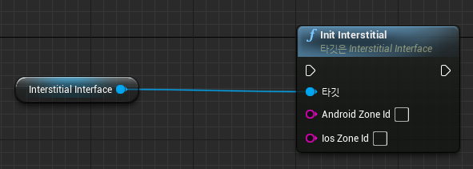
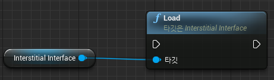
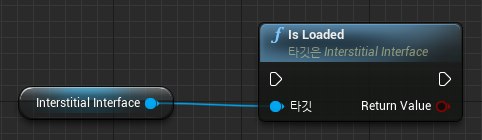
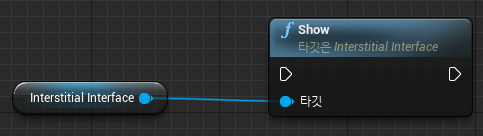
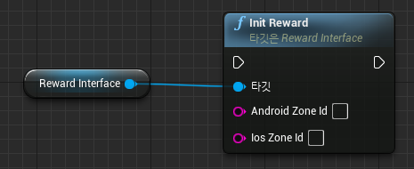
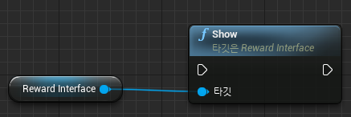
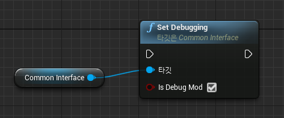
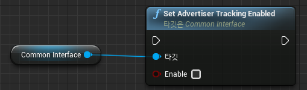
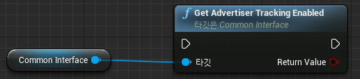

# BidmadPlugin

BidmadPlugin은 모바일 앱 광고 SDK인 Bidmad를 Unreal에서 사용하기 위한 Plugin입니다.<br>
Plugin을 사용하여 Unreal 모바일 앱에서 전면 / 보상형 광고를 게재 할 수 있습니다.<br>

- [최신 버전 및 샘플 프로젝트 다운로드](https://github.com/bidmad/Bidmad-Unreal/archive/master.zip)

## 시작하기
### 1. 요구 사항 

|OS|버전|참고사항|
|---|---|---|
|Android|TargetSDK 30 / MinSDK 21||
|iOS|Target iOS 12 / Xcode 13||

### 2. Plugin 추가 및 설정
샘플 프로젝트에 포함된 **Plugins/BidmadPlugin**의 폴더와 파일을 Plugin을 적용할 프로젝트의 Plugins폴더로 복사합니다.<br>
그리고, 프로젝트 내 **Source/프로젝트.Build.cs**파일에 선언된 PublicDependencyModuleNames.AddRange에 BidmadPlugin을 추가합니다.

```
PublicDependencyModuleNames.AddRange(new string[] { "Core", "CoreUObject", "Engine", "InputCore", "HeadMountedDisplay", "BidmadPlugin" });
```

#### 2.1 iOS 설정

iOS의 경우 아래와 같이 추가 프로젝트 설정이 필요합니다.<br>
​*Apple Store에서 요구하는 개인정보 보호에 관한 가이드가 필요한 경우 [이곳](https://github.com/bidmad/Bidmad-Unreal/wiki/Apple-privacy-survey%5BKOR%5D)을 참고하세요.

1. Settings → Project Settings → Platforms → iOS 세팅 패널 내부에서, 다음과 같이 프로젝트 설정을 추가합니다.<br>

<br>
​
2. Additional Plist Data 에 NSAppTransportSecurity, NSUserTrackingUsageDescription, SKAdNetworkItems 를 추가합니다.

<br>

**아래 설정 값 중 <string>ca-app-pub-XXXX~XXXX</string> 을 광고를 집행하는 애드몹 계정의 iOS용 App ID 로 변경하십시오.**<br> 

```
<key>GADApplicationIdentifier</key>
<string>ca-app-pub-XXXX~XXXX</string>
<key>NSAppTransportSecurity</key>
<dict>
  <key>NSAllowsArbitraryLoads</key>
  <true/>
  <key>NSAllowsArbitraryLoadsForMedia</key>
  <true/>
  <key>NSAllowsArbitraryLoadsInWebContent</key>
  <true/>
</dict>
<key>NSUserTrackingUsageDescription</key>
<string>This identifier will be used to deliver personalized ads to you.</string>
<key>SKAdNetworkItems</key>
<array>
  <dict>
    <key>SKAdNetworkIdentifier</key>
    <string>22mmun2rn5.skadnetwork</string>
  </dict>
  <dict>
    <key>SKAdNetworkIdentifier</key>
    <string>238da6jt44.skadnetwork</string>
  </dict>
  <dict>
    <key>SKAdNetworkIdentifier</key>
    <string>24t9a8vw3c.skadnetwork</string>
  </dict>
  <dict>
    <key>SKAdNetworkIdentifier</key>
    <string>252b5q8x7y.skadnetwork</string>
  </dict>
  <dict>
    <key>SKAdNetworkIdentifier</key>
    <string>275upjj5gd.skadnetwork</string>
  </dict>
  <dict>
    <key>SKAdNetworkIdentifier</key>
    <string>294l99pt4k.skadnetwork</string>
  </dict>
  <dict>
    <key>SKAdNetworkIdentifier</key>
    <string>2fnua5tdw4.skadnetwork</string>
  </dict>
  <dict>
    <key>SKAdNetworkIdentifier</key>
    <string>2u9pt9hc89.skadnetwork</string>
  </dict>
  <dict>
    <key>SKAdNetworkIdentifier</key>
    <string>32z4fx6l9h.skadnetwork</string>
  </dict>
  <dict>
    <key>SKAdNetworkIdentifier</key>
    <string>3l6bd9hu43.skadnetwork</string>
  </dict>
  <dict>
    <key>SKAdNetworkIdentifier</key>
    <string>3qcr597p9d.skadnetwork</string>
  </dict>
  <dict>
    <key>SKAdNetworkIdentifier</key>
    <string>3qy4746246.skadnetwork</string>
  </dict>
  <dict>
    <key>SKAdNetworkIdentifier</key>
    <string>3rd42ekr43.skadnetwork</string>
  </dict>
  <dict>
    <key>SKAdNetworkIdentifier</key>
    <string>3sh42y64q3.skadnetwork</string>
  </dict>
  <dict>
    <key>SKAdNetworkIdentifier</key>
    <string>424m5254lk.skadnetwork</string>
  </dict>
  <dict>
    <key>SKAdNetworkIdentifier</key>
    <string>4468km3ulz.skadnetwork</string>
  </dict>
  <dict>
    <key>SKAdNetworkIdentifier</key>
    <string>44jx6755aq.skadnetwork</string>
  </dict>
  <dict>
    <key>SKAdNetworkIdentifier</key>
    <string>44n7hlldy6.skadnetwork</string>
  </dict>
  <dict>
    <key>SKAdNetworkIdentifier</key>
    <string>488r3q3dtq.skadnetwork</string>
  </dict>
  <dict>
    <key>SKAdNetworkIdentifier</key>
    <string>4dzt52r2t5.skadnetwork</string>
  </dict>
  <dict>
    <key>SKAdNetworkIdentifier</key>
    <string>4fzdc2evr5.skadnetwork</string>
  </dict>
  <dict>
    <key>SKAdNetworkIdentifier</key>
    <string>4pfyvq9l8r.skadnetwork</string>
  </dict>
  <dict>
    <key>SKAdNetworkIdentifier</key>
    <string>4w7y6s5ca2.skadnetwork</string>
  </dict>
  <dict>
    <key>SKAdNetworkIdentifier</key>
    <string>523jb4fst2.skadnetwork</string>
  </dict>
  <dict>
    <key>SKAdNetworkIdentifier</key>
    <string>52fl2v3hgk.skadnetwork</string>
  </dict>
  <dict>
    <key>SKAdNetworkIdentifier</key>
    <string>54nzkqm89y.skadnetwork</string>
  </dict>
  <dict>
    <key>SKAdNetworkIdentifier</key>
    <string>578prtvx9j.skadnetwork</string>
  </dict>
  <dict>
    <key>SKAdNetworkIdentifier</key>
    <string>5a6flpkh64.skadnetwork</string>
  </dict>
  <dict>
    <key>SKAdNetworkIdentifier</key>
    <string>5l3tpt7t6e.skadnetwork</string>
  </dict>
  <dict>
    <key>SKAdNetworkIdentifier</key>
    <string>5lm9lj6jb7.skadnetwork</string>
  </dict>
  <dict>
    <key>SKAdNetworkIdentifier</key>
    <string>5tjdwbrq8w.skadnetwork</string>
  </dict>
  <dict>
    <key>SKAdNetworkIdentifier</key>
    <string>6964rsfnh4.skadnetwork</string>
  </dict>
  <dict>
    <key>SKAdNetworkIdentifier</key>
    <string>6g9af3uyq4.skadnetwork</string>
  </dict>
  <dict>
    <key>SKAdNetworkIdentifier</key>
    <string>6xzpu9s2p8.skadnetwork</string>
  </dict>
  <dict>
    <key>SKAdNetworkIdentifier</key>
    <string>737z793b9f.skadnetwork</string>
  </dict>
  <dict>
    <key>SKAdNetworkIdentifier</key>
    <string>74b6s63p6l.skadnetwork</string>
  </dict>
  <dict>
    <key>SKAdNetworkIdentifier</key>
    <string>7953jerfzd.skadnetwork</string>
  </dict>
  <dict>
    <key>SKAdNetworkIdentifier</key>
    <string>79pbpufp6p.skadnetwork</string>
  </dict>
  <dict>
    <key>SKAdNetworkIdentifier</key>
    <string>7fmhfwg9en.skadnetwork</string>
  </dict>
  <dict>
    <key>SKAdNetworkIdentifier</key>
    <string>7rz58n8ntl.skadnetwork</string>
  </dict>
  <dict>
    <key>SKAdNetworkIdentifier</key>
    <string>7ug5zh24hu.skadnetwork</string>
  </dict>
  <dict>
    <key>SKAdNetworkIdentifier</key>
    <string>84993kbrcf.skadnetwork</string>
  </dict>
  <dict>
    <key>SKAdNetworkIdentifier</key>
    <string>8c4e2ghe7u.skadnetwork</string>
  </dict>
  <dict>
    <key>SKAdNetworkIdentifier</key>
    <string>8s468mfl3y.skadnetwork</string>
  </dict>
  <dict>
    <key>SKAdNetworkIdentifier</key>
    <string>97r2b46745.skadnetwork</string>
  </dict>
  <dict>
    <key>SKAdNetworkIdentifier</key>
    <string>9b89h5y424.skadnetwork</string>
  </dict>
  <dict>
    <key>SKAdNetworkIdentifier</key>
    <string>9g2aggbj52.skadnetwork</string>
  </dict>
  <dict>
    <key>SKAdNetworkIdentifier</key>
    <string>9nlqeag3gk.skadnetwork</string>
  </dict>
  <dict>
    <key>SKAdNetworkIdentifier</key>
    <string>9rd848q2bz.skadnetwork</string>
  </dict>
  <dict>
    <key>SKAdNetworkIdentifier</key>
    <string>9t245vhmpl.skadnetwork</string>
  </dict>
  <dict>
    <key>SKAdNetworkIdentifier</key>
    <string>9yg77x724h.skadnetwork</string>
  </dict>
  <dict>
    <key>SKAdNetworkIdentifier</key>
    <string>a2p9lx4jpn.skadnetwork</string>
  </dict>
  <dict>
    <key>SKAdNetworkIdentifier</key>
    <string>a7xqa6mtl2.skadnetwork</string>
  </dict>
  <dict>
    <key>SKAdNetworkIdentifier</key>
    <string>a8cz6cu7e5.skadnetwork</string>
  </dict>
  <dict>
    <key>SKAdNetworkIdentifier</key>
    <string>av6w8kgt66.skadnetwork</string>
  </dict>
  <dict>
    <key>SKAdNetworkIdentifier</key>
    <string>b9bk5wbcq9.skadnetwork</string>
  </dict>
  <dict>
    <key>SKAdNetworkIdentifier</key>
    <string>bmxgpxpgc.skadnetwork</string>
  </dict>
  <dict>
    <key>SKAdNetworkIdentifier</key>
    <string>c3frkrj4fj.skadnetwork</string>
  </dict>
  <dict>
    <key>SKAdNetworkIdentifier</key>
    <string>c6k4g5qg8m.skadnetwork</string>
  </dict>
  <dict>
    <key>SKAdNetworkIdentifier</key>
    <string>cg4yq2srnc.skadnetwork</string>
  </dict>
  <dict>
    <key>SKAdNetworkIdentifier</key>
    <string>cj5566h2ga.skadnetwork</string>
  </dict>
  <dict>
    <key>SKAdNetworkIdentifier</key>
    <string>cstr6suwn9.skadnetwork</string>
  </dict>
  <dict>
    <key>SKAdNetworkIdentifier</key>
    <string>dkc879ngq3.skadnetwork</string>
  </dict>
  <dict>
    <key>SKAdNetworkIdentifier</key>
    <string>dzg6xy7pwj.skadnetwork</string>
  </dict>
  <dict>
    <key>SKAdNetworkIdentifier</key>
    <string>e5fvkxwrpn.skadnetwork</string>
  </dict>
  <dict>
    <key>SKAdNetworkIdentifier</key>
    <string>ecpz2srf59.skadnetwork</string>
  </dict>
  <dict>
    <key>SKAdNetworkIdentifier</key>
    <string>ejvt5qm6ak.skadnetwork</string>
  </dict>
  <dict>
    <key>SKAdNetworkIdentifier</key>
    <string>f38h382jlk.skadnetwork</string>
  </dict>
  <dict>
    <key>SKAdNetworkIdentifier</key>
    <string>f73kdq92p3.skadnetwork</string>
  </dict>
  <dict>
    <key>SKAdNetworkIdentifier</key>
    <string>f7s53z58qe.skadnetwork</string>
  </dict>
  <dict>
    <key>SKAdNetworkIdentifier</key>
    <string>feyaarzu9v.skadnetwork</string>
  </dict>
  <dict>
    <key>SKAdNetworkIdentifier</key>
    <string>g28c52eehv.skadnetwork</string>
  </dict>
  <dict>
    <key>SKAdNetworkIdentifier</key>
    <string>g2y4y55b64.skadnetwork</string>
  </dict>
  <dict>
    <key>SKAdNetworkIdentifier</key>
    <string>ggvn48r87g.skadnetwork</string>
  </dict>
  <dict>
    <key>SKAdNetworkIdentifier</key>
    <string>glqzh8vgby.skadnetwork</string>
  </dict>
  <dict>
    <key>SKAdNetworkIdentifier</key>
    <string>gta9lk7p23.skadnetwork</string>
  </dict>
  <dict>
    <key>SKAdNetworkIdentifier</key>
    <string>gvmwg8q7h5.skadnetwork</string>
  </dict>
  <dict>
    <key>SKAdNetworkIdentifier</key>
    <string>hdw39hrw9y.skadnetwork</string>
  </dict>
  <dict>
    <key>SKAdNetworkIdentifier</key>
    <string>hs6bdukanm.skadnetwork</string>
  </dict>
  <dict>
    <key>SKAdNetworkIdentifier</key>
    <string>k674qkevps.skadnetwork</string>
  </dict>
  <dict>
    <key>SKAdNetworkIdentifier</key>
    <string>kbd757ywx3.skadnetwork</string>
  </dict>
  <dict>
    <key>SKAdNetworkIdentifier</key>
    <string>kbmxgpxpgc.skadnetwork</string>
  </dict>
  <dict>
    <key>SKAdNetworkIdentifier</key>
    <string>klf5c3l5u5.skadnetwork</string>
  </dict>
  <dict>
    <key>SKAdNetworkIdentifier</key>
    <string>krvm3zuq6h.skadnetwork</string>
  </dict>
  <dict>
    <key>SKAdNetworkIdentifier</key>
    <string>lr83yxwka7.skadnetwork</string>
  </dict>
  <dict>
    <key>SKAdNetworkIdentifier</key>
    <string>ludvb6z3bs.skadnetwork</string>
  </dict>
  <dict>
    <key>SKAdNetworkIdentifier</key>
    <string>m5mvw97r93.skadnetwork</string>
  </dict>
  <dict>
    <key>SKAdNetworkIdentifier</key>
    <string>m8dbw4sv7c.skadnetwork</string>
  </dict>
  <dict>
    <key>SKAdNetworkIdentifier</key>
    <string>mlmmfzh3r3.skadnetwork</string>
  </dict>
  <dict>
    <key>SKAdNetworkIdentifier</key>
    <string>mls7yz5dvl.skadnetwork</string>
  </dict>
  <dict>
    <key>SKAdNetworkIdentifier</key>
    <string>mp6xlyr22a.skadnetwork</string>
  </dict>
  <dict>
    <key>SKAdNetworkIdentifier</key>
    <string>mtkv5xtk9e.skadnetwork</string>
  </dict>
  <dict>
    <key>SKAdNetworkIdentifier</key>
    <string>n66cz3y3bx.skadnetwork</string>
  </dict>
  <dict>
    <key>SKAdNetworkIdentifier</key>
    <string>n6fk4nfna4.skadnetwork</string>
  </dict>
  <dict>
    <key>SKAdNetworkIdentifier</key>
    <string>n9x2a789qt.skadnetwork</string>
  </dict>
  <dict>
    <key>SKAdNetworkIdentifier</key>
    <string>nzq8sh4pbs.skadnetwork</string>
  </dict>
  <dict>
    <key>SKAdNetworkIdentifier</key>
    <string>p78axxw29g.skadnetwork</string>
  </dict>
  <dict>
    <key>SKAdNetworkIdentifier</key>
    <string>ppxm28t8ap.skadnetwork</string>
  </dict>
  <dict>
    <key>SKAdNetworkIdentifier</key>
    <string>prcb7njmu6.skadnetwork</string>
  </dict>
  <dict>
    <key>SKAdNetworkIdentifier</key>
    <string>pu4na253f3.skadnetwork</string>
  </dict>
  <dict>
    <key>SKAdNetworkIdentifier</key>
    <string>pwa73g5rt2.skadnetwork</string>
  </dict>
  <dict>
    <key>SKAdNetworkIdentifier</key>
    <string>pwdxu55a5a.skadnetwork</string>
  </dict>
  <dict>
    <key>SKAdNetworkIdentifier</key>
    <string>qqp299437r.skadnetwork</string>
  </dict>
  <dict>
    <key>SKAdNetworkIdentifier</key>
    <string>qu637u8glc.skadnetwork</string>
  </dict>
  <dict>
    <key>SKAdNetworkIdentifier</key>
    <string>r45fhb6rf7.skadnetwork</string>
  </dict>
  <dict>
    <key>SKAdNetworkIdentifier</key>
    <string>rvh3l7un93.skadnetwork</string>
  </dict>
  <dict>
    <key>SKAdNetworkIdentifier</key>
    <string>rx5hdcabgc.skadnetwork</string>
  </dict>
  <dict>
    <key>SKAdNetworkIdentifier</key>
    <string>s39g8k73mm.skadnetwork</string>
  </dict>
  <dict>
    <key>SKAdNetworkIdentifier</key>
    <string>su67r6k2v3.skadnetwork</string>
  </dict>
  <dict>
    <key>SKAdNetworkIdentifier</key>
    <string>t38b2kh725.skadnetwork</string>
  </dict>
  <dict>
    <key>SKAdNetworkIdentifier</key>
    <string>tl55sbb4fm.skadnetwork</string>
  </dict>
  <dict>
    <key>SKAdNetworkIdentifier</key>
    <string>u679fj5vs4.skadnetwork</string>
  </dict>
  <dict>
    <key>SKAdNetworkIdentifier</key>
    <string>uw77j35x4d.skadnetwork</string>
  </dict>
  <dict>
    <key>SKAdNetworkIdentifier</key>
    <string>v4nxqhlyqp.skadnetwork</string>
  </dict>
  <dict>
    <key>SKAdNetworkIdentifier</key>
    <string>v72qych5uu.skadnetwork</string>
  </dict>
  <dict>
    <key>SKAdNetworkIdentifier</key>
    <string>v79kvwwj4g.skadnetwork</string>
  </dict>
  <dict>
    <key>SKAdNetworkIdentifier</key>
    <string>vcra2ehyfk.skadnetwork</string>
  </dict>
  <dict>
    <key>SKAdNetworkIdentifier</key>
    <string>w9q455wk68.skadnetwork</string>
  </dict>
  <dict>
    <key>SKAdNetworkIdentifier</key>
    <string>wg4vff78zm.skadnetwork</string>
  </dict>
  <dict>
    <key>SKAdNetworkIdentifier</key>
    <string>wzmmz9fp6w.skadnetwork</string>
  </dict>
  <dict>
    <key>SKAdNetworkIdentifier</key>
    <string>wzmmZ9fp6w.skadnetwork</string>
  </dict>
  <dict>
    <key>SKAdNetworkIdentifier</key>
    <string>x44k69ngh6.skadnetwork</string>
  </dict>
  <dict>
    <key>SKAdNetworkIdentifier</key>
    <string>x5l83yy675.skadnetwork</string>
  </dict>
  <dict>
    <key>SKAdNetworkIdentifier</key>
    <string>x8jxxk4ff5.skadnetwork</string>
  </dict>
  <dict>
    <key>SKAdNetworkIdentifier</key>
    <string>x8uqf25wch.skadnetwork</string>
  </dict>
  <dict>
    <key>SKAdNetworkIdentifier</key>
    <string>xy9t38ct57.skadnetwork</string>
  </dict>
  <dict>
    <key>SKAdNetworkIdentifier</key>
    <string>y45688jllp.skadnetwork</string>
  </dict>
  <dict>
    <key>SKAdNetworkIdentifier</key>
    <string>yclnxrl5pm.skadnetwork</string>
  </dict>
  <dict>
    <key>SKAdNetworkIdentifier</key>
    <string>ydx93a7ass.skadnetwork</string>
  </dict>
  <dict>
    <key>SKAdNetworkIdentifier</key>
    <string>yrqqpx2mcb.skadnetwork</string>
  </dict>
  <dict>
    <key>SKAdNetworkIdentifier</key>
    <string>z4gj7hsk7h.skadnetwork</string>
  </dict>
  <dict>
    <key>SKAdNetworkIdentifier</key>
    <string>zmvfpc5aq8.skadnetwork</string>
  </dict>
  <dict>
    <key>SKAdNetworkIdentifier</key>
    <string>zq492l623r.skadnetwork</string>
  </dict>
</array>
```

3. Additional Non-Shipping Linker Flags / Additional Shipping Linker Flags 에 "-ObjC" 를 아래 이미지와 같이 기입해주십시오.

<br>

4. Support bitcode in Shipping 값을 아래 이미지와 같이 OFF 로 세팅하십시오.

<br>

### 3. Interstitial

Plugin을 통해 전면 광고를 요청(Load)하고 광고를 노출(Show)하는 방법은 다음과 같습니다.<br>

#### 3.1 Init

Bidmad는 Android / iOS에 대한 ZoneId가 각각 발급되며, 발급 받은 ZoneId를 OS에 맞게 Init 함수에 세팅합니다.



#### 3.2 AD Load

Init 함수를 호출했다면 그 다음으로 Load 함수를 호출하여 광고를 요청합니다.<br>
*iOS14 이상에서는 사용자가 앱 추적 승인에 동의한 것을 확인 후 Load 하기를 권장 드립니다. 
Load에 대한 결과는 Callback을 통해서 확인할 수 있습니다.



*Reward / Interstitial 광고 요청 후 광고가 Load 되기까지 일정 시간 딜레이가 발생합니다.<br>
Load 딜레이를 View단에 노출시키지 않기 위해 앱 시작 시 바로 광고를 요청하는 것을 권장 드립니다.

#### 3.3 Ad IsLoaded

Show 함수를 호출하기전 IsLoaded 함수를 호출하여 광고 Load 여부를 확인합니다.



#### 3.4 Ad Show

Load 함수를 통해 광고요청에 성공하였다면, 광고를 노출시킵니다.



*광고를 Show했다면 Plugin에서 다시 Load를 수행합니다.<br>
이때 호출된 Load의 결과가 Fail인 경우에는 Load를 재호출 하지 않습니다.

#### 3.5 Ad Callback

Interstitial에서는 Load / Show / Close / Failed 4종의 Callback을 제공합니다.


### 4. Reward

Plugin을 통해 보상형 광고를 요청(Load)하고 광고를 노출(Show)하는 방법은 다음과 같습니다.<br>

#### 4.1 Init

Bidmad는 Android / iOS에 대한 ZoneId가 각각 발급되며, 발급 받은 ZoneId를 OS에 맞게 Init 함수에 세팅합니다.



#### 4.2 Load

Init 함수를 호출했다면 그 다음으로 Load 함수를 호출하여 광고를 요청합니다.<br>
*iOS14 이상에서는 사용자가 앱 추적 승인에 동의한 것을 확인 후 Load 하기를 권장 드립니다. 
Load에 대한 결과는 Callback을 통해서 확인할 수 있습니다.


#### 4.3 IsLoaded

Show 함수를 호출하기전 IsLoaded 함수를 호출하여 광고 Load 여부를 확인합니다.


#### 4.4 Show

Load 함수를 통해 광고요청에 성공하였다면, 광고를 노출시킵니다.



*광고를 Show했다면 Plugin에서 다시 Load를 수행합니다.<br>
이때 호출된 Load의 결과가 Fail인 경우에는 Load를 재호출 하지 않습니다.

#### 4.5 Ad Callback

Reward에서는 Load / Show / Close / Failed / Complete / Skipped 6종의 Callback을 제공합니다.


### 5. Common

Common는 디버깅 모드, iOS14 AppTrackingAuthorization 기능 등 광고 외 기능을 제공하는 컴포넌트 입니다.

#### 5.1 SetDebugging

SetDebugging True를 호출 시 디버깅 로그가 출력됩니다.



#### 5.2 ReqAdTrackingAuthorization

iOS 14에서 앱 추적 투명성 동의 팝업을 노출 시키고, 그에 대한 결과 Callback을 제공합니다.


#### 5.2 SetAdvertiserTrackingEnabled

Plugin에서 제공하는 ReqAdTrackingAuthorization이 아닌 다른 방법을 통해 앱 추적 투명성 동의를 얻는 경우,
<br>사용자가 동의했다면 True, 거부했다면 False를 SetAdvertiserTrackingEnabled를 통해 전달하세요.



#### 5.2 GetAdvertiserTrackingEnabled

SetAdvertiserTrackingEnabled을 통해 세팅한 값을 확인합니다.



#### References
- [Unreal GDPR Guide KOR](./Readme_Contents/Unreal_GDPR_Guide_[KOR].md)
- [Unreal GDPR Guide ENG](./Readme_Contents/Unreal_GDPR_Guide_[ENG].md)
