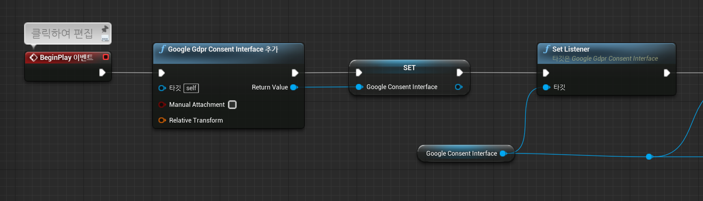
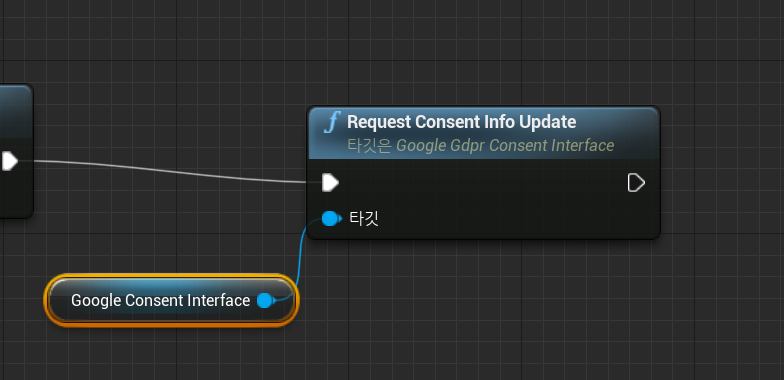
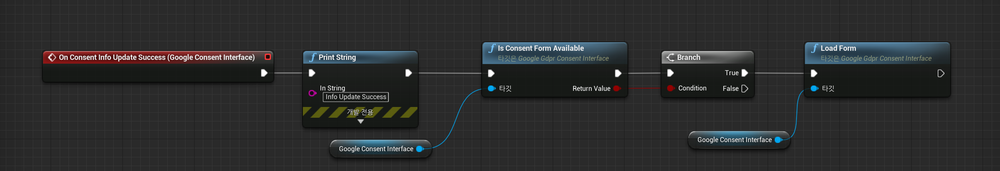
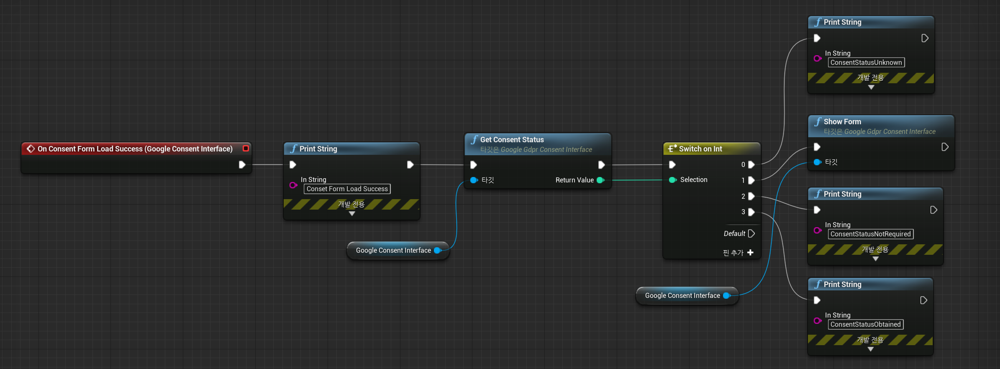
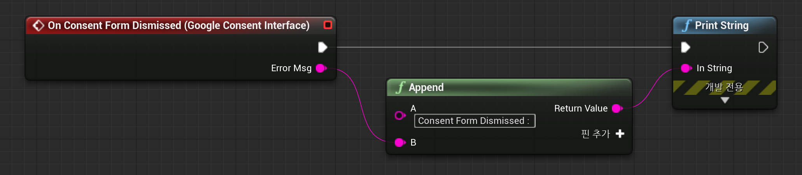
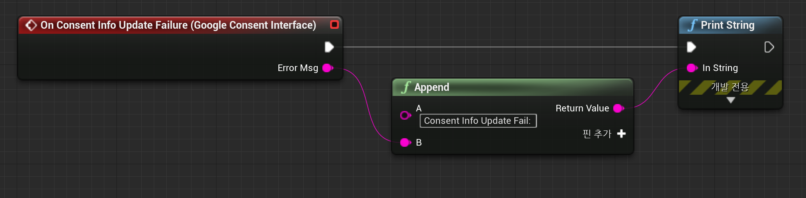
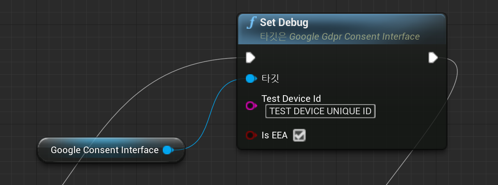
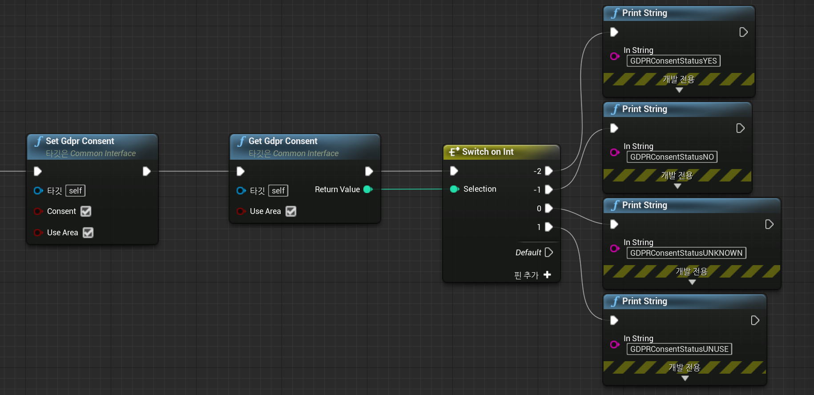

# Unreal GDPR Guide [ENG]

# **Requesting Consent from European Users(GDPR)**

Interface for GDPR (EU General Data Protection Regulation) provided by AdNetwork SDK linked with Bidmad is provided.As there are different interfaces depending on the Ad Network, Bidmad provide a total of two interfaces, so please use the interface that suits your network.

- Some networks do not provide the GDPR Interface, so please inquire before applying the GDPR.

---

### **Google GDPR Interface**

Google sets up a user consent pop-up through the Funding Choices platform and exposes it to users through the UMP SDK.Google GDPR Interface is a wrapper interface for UMP SDK provided by Google (Admob / Admanager).If you applied Google GDPR through UMP SDK before Bidmad, you don't need to change to the interface provided by Bidmad.

After creating the user consent pop-up form in Funding Choices, follow the instructions below to request the user consent.

### **Initial GDPR Interface Setting**

Add a Google GDPR Consent Interface into your actor class, and set Listener.



### **Google GDPR goes through the following steps**

```
1. Request a consent popup to Google GDPR SDK.
2. Request to load the consent popup.
3. Check if GDPR consent is necessary and display the consent popup form to user.
4. Receive the results from consent popup form.
```

### **1. Request Consent Popup**



### **2. Request to Load Consent Popup Form**

After requesting consent popup, you will be receiving an event "On Consent Info Update Success." After that, Check if consent form is available to be loaded, and call 'Load Form.'



### **3. Check if GDPR Consent is necessary and display the Consent form**

Once the consent form is loaded, it is highly recommended to check where the consent is necessary for app users. Check the consent requirement and consent-obtainment information with 'Get Consent Status' function and if the returned value is 1, it means the user's consent is required. At that point, show the consent form to the user by calling 'Show Form.'



### **4. Checking the consent form result**

Once the user completes the consent process, you will be getting a "consent form dismissed" callback. If the callback sends back null, it means that the user either chose 'consent' or 'not consent.'



### **Request and Form Loading Failure Callback**

Once the Consent Info Request failed, the following callback will be called



Once the Consent Form Loading failed, the following callback will be called


### **Initial Debugging and Test Setting**

1. Once you are done with all the settings above, please request consent form Google GDPR
2. And you will be seeing the following log on the Xcode console. OR you will be seeing the following log on Android LogCat.
    - `<UMP SDK> To enable debug mode for this device, set: UMPDebugSettings.testDeviceIdentifiers = @[ @"Test Device Unique ID" ];`
    - `UserMessagingPlatform: Use new ConsentDebugSettings.Builder().addTestDeviceHashedId("TEST-DEVICE-HASHED-ID") to set this as a debug device.`
3. Insert the Test Device Unique ID or TEST-DEVICE-HASHED-ID to the following code and include the code in your initial settings explained above.

    

---

### **GDPR Interface**

This is an interface to the GDPR provided by other ad networks excluding Google (Admob / Admanager).In other ad networks, the interface is configured to deliver the value of the user consent result (agree / disagree) to the SDK when requesting an advertisement.The GDPR Interface provided by Bidmad delivers the result of user consent to each Ad Network's SDK.

If you want to use the GDPR Interface, develop a pop-up to obtain user consent and then call the GDPR Interface according to the pop-up result.

### **GDPR Consent Status and Europe Area Setting (if user-consent, set to true / if EEA, set to true) and Getting Consent Status.**



### **GDPR Setting Values (GDPRConsentStatus: Int)**

`GDPRConsentStatusYES = 1,
GDPRConsentStatusNO = 0,
GDPRConsentStatusUNKNOWN = -1,
GDPRConsentStatusUNUSE = -2`
